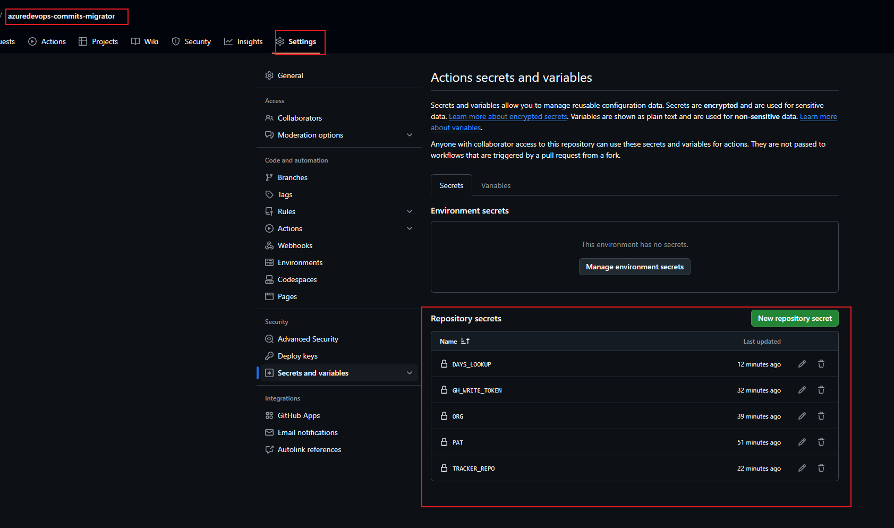
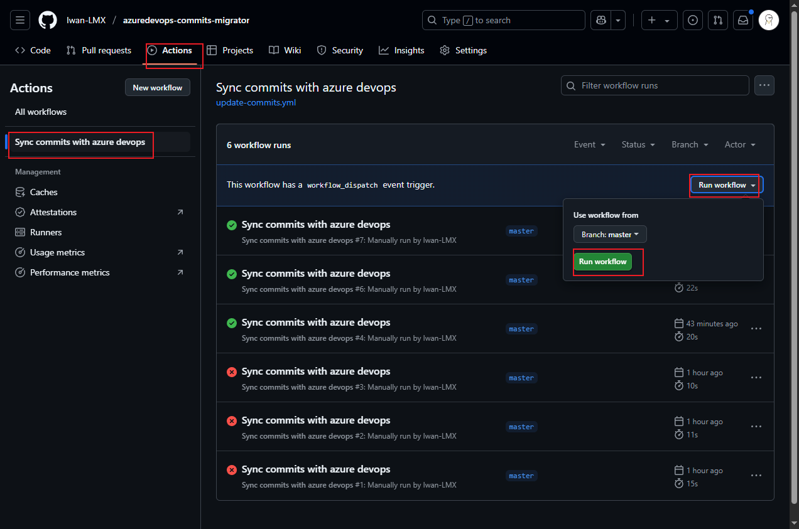

Azure DevOps to GitHub Migration Tool


This project helps users migrate commits and Pull Requests (PRs) from an Azure DevOps repository to a GitHub repository. It uses a GitHub workflow to automate the migration process.


# Getting Started
1. Fork this repository\
  Click the Fork button in the top-right corner of this page to fork the master repository.

2. Go to forked repo in your repository

3. Change this line property in `update-comits.yml` by your information:\
  `run: git config --global user.email "<your github email>" && git config --global user.name "<your github user name>"`

4. Change the name in `script.js` at line 126\
  `let commits = await getCommits(project, repo.name, "<Your azure commit user name>", repo.defaultBranch);`

5. Add secrets:\
  settings -> Actions secrets and variables -> Repository secrets -> New repository secrets
  

    ```
    DAYS_LOOKUP		# It's a number, I set to 7. I'm not sure for it's usage

    GH_WRITE_TOKEN	# This is Github PAT, you'll know how to set below

    ORG				# Your Azure DevOps Organization name (e.g. `dev.azure.com/abcd` abcd is the value)

    PAT				# Your Azure PAT, you'll know how to get it below

    TRACKER_REPO	# Your destination Github Repository e.g. `Iwan-LMX/azuredevops-commits-migrator` is the value

    ```
6. Run the workflow\
	Actions -> Sync commits with azure devops -> run workflow
	
## Set Github PAT
Click your avatar in github, find settings -> Develop settings -> Personal access tokens (classic) / Fine-grained personal access tokens -> make sure the your target github repo is covered in the `Repository access`

## Set Azure PAT
user settings (in your project right top) -> Personal access tokens -> New token (Simply give all access)


Written by [Iwan Li](https://github.com/Iwan-LMX)